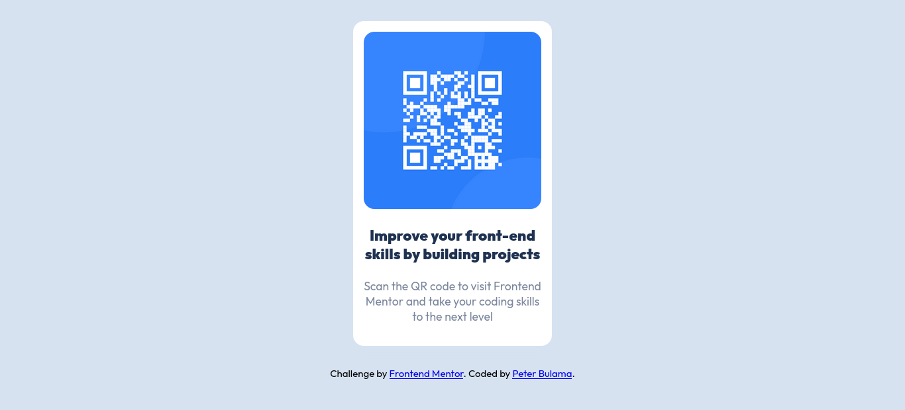

# Frontend Mentor - QR code component solution

This is a solution to the [QR code component challenge on Frontend Mentor](https://www.frontendmentor.io/challenges/qr-code-component-iux_sIO_H). Frontend Mentor challenges help you improve your coding skills by building realistic projects.

## Table of contents

- [Screenshot](#screenshot)
- [Links](#links)
- [My process](#my-process)
  - [Built with](#built-with)

**Note: Delete this note and update the table of contents based on what sections you keep.**

### Screenshot

### Links

- Solution URL: [solution URL here](https://github.com/bulamagk/Frontend-Mentor-QR-Code-Component-Challenge.git)
- Live Site URL: [Live Preview](https://bulamagk.github.io/Frontend-Mentor-QR-Code-Component-Challenge/)

## My process

Mobile First

### Built with

- Semantic HTML5 markup
- CSS custom properties
- Mobile-first workflow
